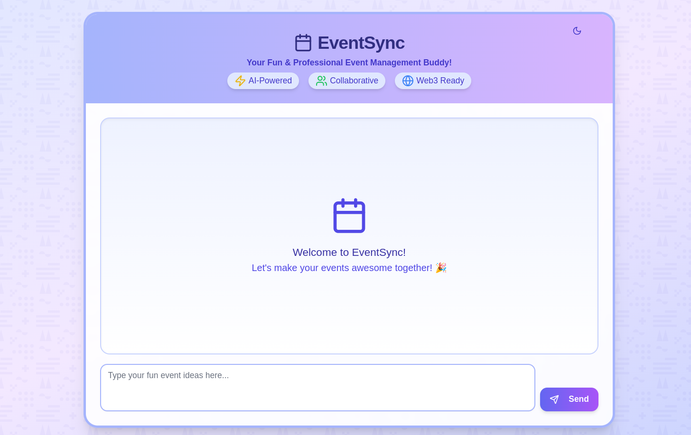

# 🎨 EventSync Frontend

A sleek, modern interface for the EventSync AI Agent - your bridge between Web2 and Web3 event management.

> 🔗 For full project details, check out the [EventSync Agent Backend](https://github.com/ofemeteng/eventsync-agent)



## ✨ Features

- 💅 Modern, responsive UI built with Next.js 14
- 🤖 Direct interaction with EventSync AI Agent
- 🔄 Real-time event management
- 🎫 Seamless Eventbrite integration
- 🎖 POAP NFT distribution dashboard

## 🚀 Quick Start

### Prerequisites

```bash
# Make sure the EventSync Agent backend is running
git clone https://github.com/ofemeteng/eventsync-agent
cd eventsync-agent
# Follow backend setup instructions
```

### Frontend Setup

```bash
# Clone the frontend repo
git clone https://github.com/ofemeteng/eventsync-frontend
cd eventsync-frontend

# Install dependencies
npm install
# or
yarn install
# or
pnpm install
# or
bun install
```

### Configuration

Create a `.env` file:
```env
NEXT_PUBLIC_API_BASE_URL=the_base_url_of_the_eventsync_backend_agent
```

### Running the Application

```bash
# Start the development server
npm run dev
# or
yarn dev
# or
pnpm dev
# or
bun dev
```

Visit [http://localhost:3000](http://localhost:3000) to see your app in action! 🎉

## 🛠 Technical Stack

- [Next.js 14](https://nextjs.org)
- [Geist Font](https://vercel.com/font)
- [Tailwind CSS](https://tailwindcss.com)
- Modern React patterns

## 📚 Development Notes

- The app auto-updates as you edit `app/page.tsx`
- Uses `next/font` for optimized font loading
- Requires backend connection for full functionality

## 🔗 Useful Links

- [EventSync Agent Documentation](https://github.com/ofemeteng/eventsync-agent)
- [Next.js Documentation](https://nextjs.org/docs)
- [Learn Next.js](https://nextjs.org/learn)

## 🚀 Deployment

Deploy on [Vercel](https://vercel.com/new?utm_medium=default-template&filter=next.js&utm_source=create-next-app&utm_campaign=create-next-app-readme) for the best experience.

---

Built with 💖 for [EventSync](https://github.com/ofemeteng/eventsync-agent)